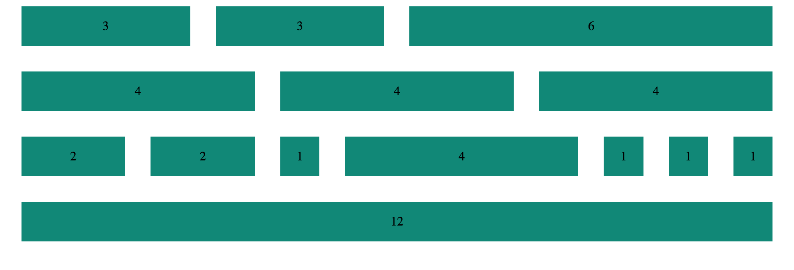

# _[Custom Grid Practice](https://webdesign.tutsplus.com/tutorials/a-simple-responsive-grid-made-even-better-with-sass--cms-21540)_

#### _Sass responsive PRACTICE, {Dec 6th, 2016}_

#### By _**Katrina Hirsch and Kyle Lange**_

## Description

_This app shows our practice using Sass mixins, for loops, and variables to make a responsive grid.  [See it live here.](https://kylelange.github.io/custom-grid/)_

## Setup/Installation Requirements

  1. Download this repo using your terminal: git clone repo-name pasted here

  2. View the code by drag-and-dropping the file into your [favorite text editor](https://atom.io)

  3. run/check-out the program by dropping the index/html file from your folder into your web browser

### Support & Contact
For questions or comments, please __email  [Kyle](baronsintrees@gmail.com)__

### Known Issues
_There are no known bugs as of the last commit. Please send an ISSUE on github in the repository if you see something we have not._

## Technologies Used

* HTML5
* CSS3
* Sass

### Legal
*Licensed under the GNU General Public License v3.0*

Copyright (c) 2016 **_Katrina Hirsch_ & _Kyle Lange_**
